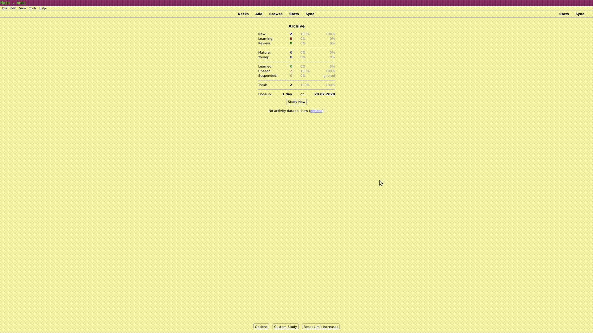
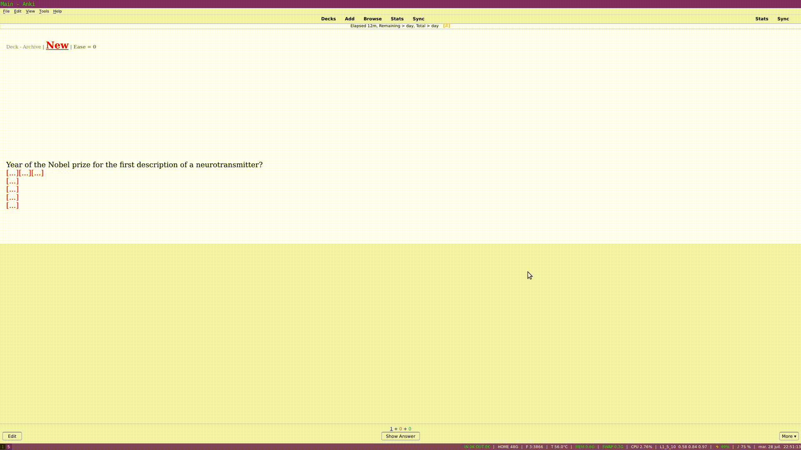

# Clozolkor
Enhancing "*cloze one by one*" script found in TheAnking's template (on his website or drive). I think the original idea/script is by user "iTraveller" in the official anki forum. Oh and don't ask why this name. The current status of this project is : I am using it daily. It is definitely stable as it does not require addons or complicated coding. It is just basic javascript added to a cloze template.

## How does it work?
Basically, you create your cards just like regular clozes but using this template. Then, when reviewing, you can use shortcuts (or buttons that appear on mobile) to reveal the cloze one by one. That means that if you have severall `c1` occlusion you will see them sequentially, same for `c2` etc. You can also show letter by letter or word by word what's underneath the cloze as a hint. Lots of things a customizable, and I should be reactive on github to provide support. Oh and don't be surprised : by default the card auto flips the front if you have not used a hint in your cloze (like Y in {{c1::X::Y}}). This behavior can interfere with the time to answer statistics of your cards, as well as addons that use this like [speed focus](https://ankiweb.net/shared/info/1046608507).

## Features 
* multiple shortcuts (show, hide, hint, etc)
* **show hint of what's hidden underneath a cloze, letter by letter or word by word**
* show all the deletion as a fixed size block, this way you can't use the size of the deletion as a hint
* hide images, leaving the size (or not) as a hint
* supports multiple cloze : if you add several `c1` you can reveal them one by one but if you add `c2`, `c3` and so one anki will automatically add new cards that reveal `c2` one by one and `c3` one by one. Basically like regular cloze so you can just convert all your cloze to this template and it will work the same.
* buttons, handy for mobile (one to reveal one cloze, one to reset, one to show a bunch, one to show everything, one to show a character hint)
* automatically scroll if the cloze is outside the frame
* autoflip is the cloze doesn't contain hints
* hints with mathjax work, but not with LaTeX as it is rendered as a picture
* **more to come (see todo below), this clozing system is the basis of my workflow, but I don't have much time to code nowadays.**

#### several demo gifs (very outdated, missing hints and hiding cloze size) :
* early version

* use it with bullet points to remembers sets. I displayed buttons on these gifs but they are designed to be used on mobile and stay hidden on the computer. You can use the first letter as hints for example :

*I just copied the content of the wikipedia page, just ignore whatever member of Pink Floyd you feel never really existed*

* use it to do followup questions: (very useful to force yourself to yell a mnemonic out loud!)

## TODO / Planned features / known issues (some are really simple, don't forget to help!)
* short video instead of gifs showcasing the new hint feature + showing example of using a mnemonic
* see if it's possible to add a {{cx:: field that would always be clozed, no matter the card number
* use the same shortcut to answer 3 if no more cloze to reveal, depending on a boolean setting
* pressing the reveal shortcut should show `{{hint:}}` fields and such when there are no more cloze to unfold
* change link color with something like `a:visited { color:red }`, as currently they can be read above the colored background instead of being hidden
* support the creation of an addon handle clozes better, especially : if interested, tell it [there](https://github.com/epiphanie-gedeon/anki-wrapper/issues/2)
* html buttons should scroll with the page (ie always appear at the same place), with something like `position:fixed/sticky`
* change the top header : turns out that ease factor and "is new" [are supported in ankidroid] (https://github.com/ankidroid/Anki-Android/wiki/AnkiDroid-Javascript-API)

#### Known issues
* I very rarely get the wrong background color, which sucks because you can still read the cloze. It seems to happen only in specific circumstances for me but this might be linked to the speed of your computer. If you have this issue regularly let me know. There might be a fix using `aFade` and `qFade` (taken from Glutanimate's IOC addon).
* links that appear blue are not hidden, they can be seen
* if a cloze ends with a picture, the hint field will sometimes not get reset, mildly annoying

## A few notes, please read
I have a limited (but increasing) understanding of anki coding, don't expect anything much from me, but PR's are welcome and don't hesitate to open an issue if you want anything. Also, I use linux and ankidroid, I can't test on other devices. Also, I strongly recommand using the addon [Symbols as you type](https://ankiweb.net/shared/info/2040501954), the author very nicely added html insertion, this way for example typing `::c::` is replaced by `}}{{c1::` which makes it a ton faster to use this addon. Same goes for `::c2::` etc. You can see a list of my suggested macros [here](https://github.com/jefdongus/insert-symbols-anki-addon/issues/13) or in the `latest_version` folder. I hope something will come out of [this thread](https://github.com/epiphanie-gedeon/anki-wrapper/issues/2).

The .js extension of the template files is there only to help with syntax highlighting while editing the files, it's more accurately html containing `<script>` parts.

I use `anki 2.1` and try to stay on the latest **stable** version (currently 2.1.22). I don't know if it works in `2.0`. I also make sure the version works on `AnkiDroid` as it it what I use, and I tend use the latest stable release. I don't usually test it on windows, macos or iOS, and am counting on your feedbacks for this.

The shortcuts and many more things can be edited in the back template, inside the script.

### If you like the idea, these addons will interest you
* [Cloze overlapper](https://github.com/Glutanimate/cloze-overlapper) addon by the Great Glutanimate, unfortunately not (yet?) ported to 2.1
* [Cloze (Hide All) addon](https://ankiweb.net/shared/info/1709973686)
* [Cloze Anything](https://github.com/matthayes/anki_cloze_anything), the creator (as opposed to me) knows how to code in js. I intend to add a "reveal one by one" feature as you can read [here](https://github.com/matthayes/anki_cloze_anything/issues/6#issuecomment-629829062). I learned about this addon only after spending time on this. His project looks better for a lot of use cases for I still intend to use my code for quite a while.
* [anki-wraper](https://github.com/epiphanie-gedeon/anki-wrapper/) seems promissing for cloze handling

## How can I get this ?
* read this page thoroughly
* optional but better : install the [additionnal card field](https://ankiweb.net/shared/info/744725736) addon as well as [clickable Tags](https://ankiweb.net/shared/info/380714095) and restart anki
    * reminder : as written above : installing the addon [Symbols as you type](https://ankiweb.net/shared/info/2040501954) will greatly increase your efficiency. Check out my macros in the `latest_version` folder
* import the latest `.apkg` file inside the `latest_version` folder into anki.   (or manually copy the front and back, they are usually identical)
* now, when you create your own clozes : just select this template instead of the old "cloze" note type
* optional : convert all your past cloze into this template : it works the same, just better
* check out the settings inside the front and back template, it is very likely that your shortcuts won't match my keyboard
* that's it, if you have **any** issue, open an issue, i'll gladly fix it for everyone else

