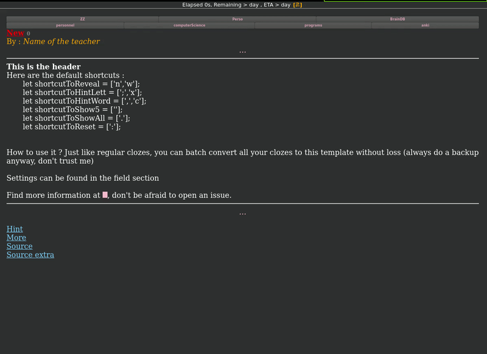

# Oliver_Cloze
enhancing "cloze one by one" script found in TheAnking template. I think the original idea/script is by user "iTraveller" in the official anki forum.

## Demo

**Please note** : I have a very limited understanding of anki coding, don't expect anything much from me, but PR's are welcome and don't hesitate to open an issue if you want anything. Also, I use linux and ankidroid, I can't test on other devices. Also, I strongly recommande using the addon ["Symbols as you type"](https://ankiweb.net/shared/info/2040501954), the author very nicely added html insertion, this way for example typing `::c::` is replaced by `}}{{c1::` which makes it a ton faster to use this addon. Same goes for `::c2::` etc.

Useful vim command to convert rapidly some clozes from its html : `s/
}} <\/div>//g | s/
{{c1::<\/div>//g | s/<li>/<li>{{c1::/g | s/<\/li>/}}<\/li>/g`

If you want to see this command in action, [click here](demo_vim2.gif).

## File description
* BlueScreenMagick_files : he started it all
* current_version : the one I'm using, tried and tested
* in progrerss : very bad coding and testing, don't go there it's a shame

## Features 
* supports multiple shortcuts
* supports image cloze deletion (thanks to /u/bluegrerenmagick)
* adds a button, handy for mobile
* more to come, this clozing system is the basis of my workflow
* added a small delay to be sure that the cloze background is loaded before hiding it, otherwize the wrong color is selected

### todo, some are really simple, don't forget to help
* add a setting section on top of the code
* figure out a way to avoid hiding cloze hints
* deduplicate the the shortcut event, make a function call
* make it so that the button only appears on mobile, depending on a boolean
* use the same shortcut to answer 3 if no more cloze to reveal, depending on a boolean
* the shortcut when seeing front should reveal the back
* add a preview : the cloze that should disappear should change color just before, as a hint of the size of the deletion
* add a shortcut that reveals everything
* shortcut for  closing everything back
* add a button to automatically cloze every space of a text selection, or increment cloze number etc

## How to
* go into current_version folder
* copy the content of front.js as the front template (look for it in the anki manual)
* copy back.js as back template
* copy styling.css into the styling part
* the .js extension is there only to help with syntax highlighting while editing the files, it's more likely html containing `<script>` parts
